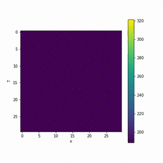

# Thermal-Simulation

This documentation is used to describe the process of utilizing Python’s ordinary differential equation solvers, odeint, 
to find numerical approximations to solutions to partial differential equations, such as the heat equation. To exemplify
this, a simple system of a 1U CubeSat was utilized. The overall results from odeint approximated equilibrium temperatures
for faces of the CubeSat.

The simulation makes simplified approximations to the system to give rough rough estimates to what to actually expect in
low-earth orbit. The system composes of a two dimensional representation of 1U CubeSat, composed of five faces that receive
different types of radiation such as solar flux and albedo effect. This is not the most accurate simulation, but gives an 
estimated idea to what temperatures in low-earth orbit may look like.

For fast computations, the resolution of the system consists of a 30 by 30 matrix which holds temperature values in each cell, constantly
updating with the evolution in time. These cells are updated by the boundary conditions, or conditions in which introduce heat into the 
two dimensional cell. 

Below is an example video of the output.

